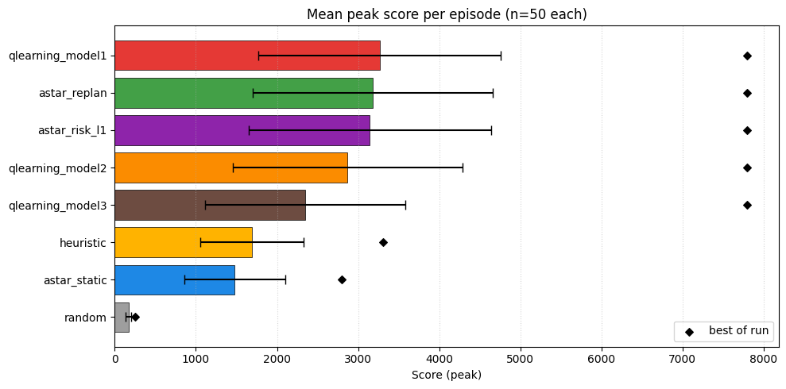
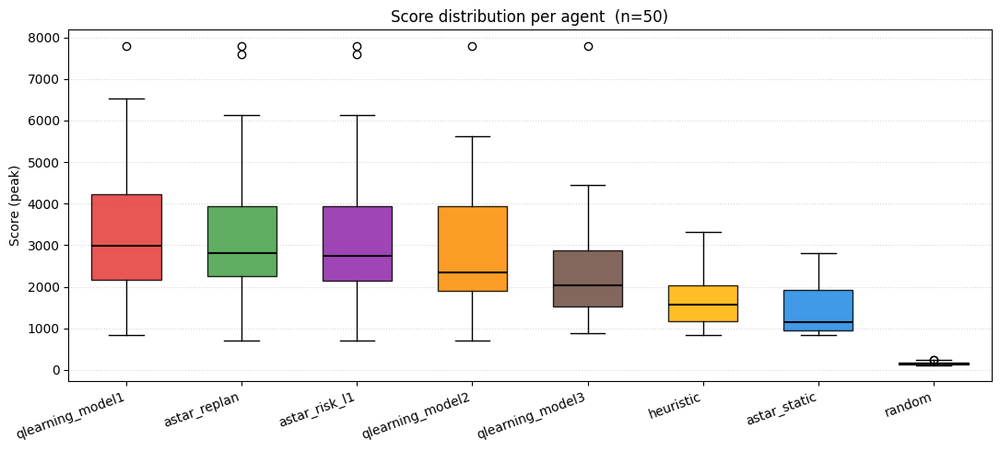
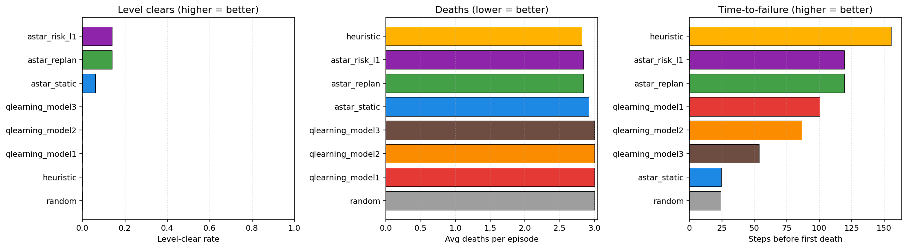
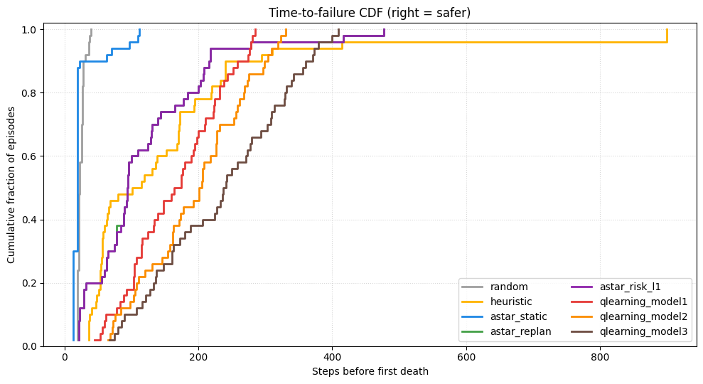
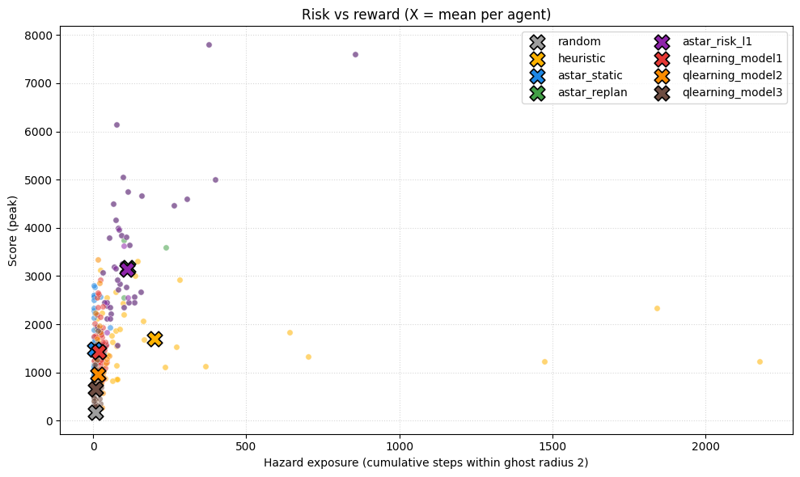
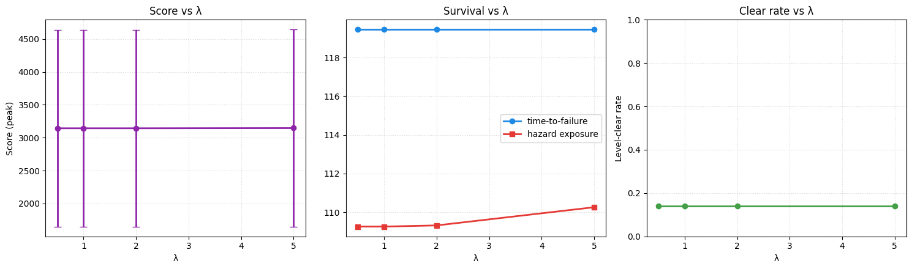
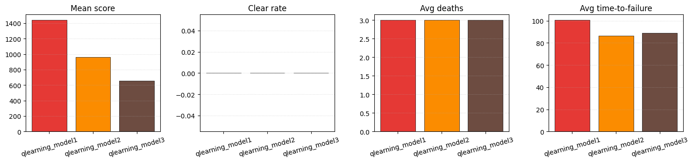
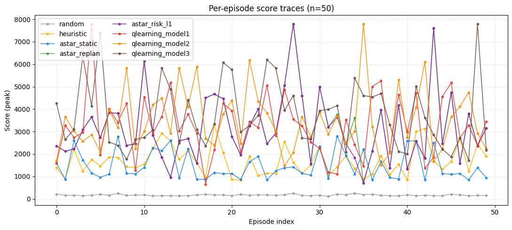
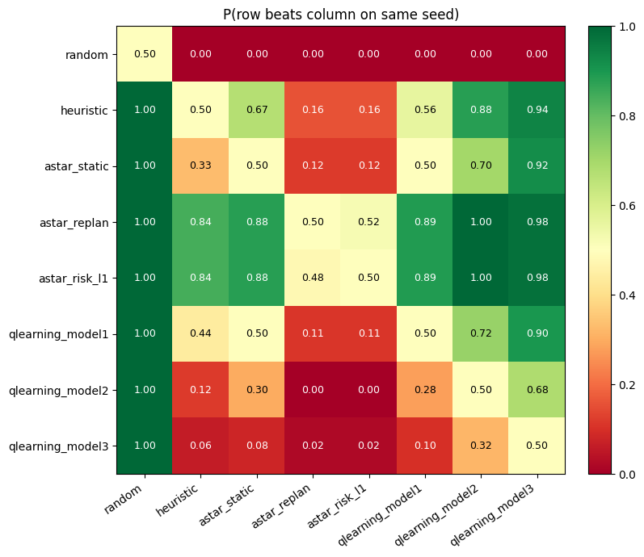

# Decision-Theoretic Navigation Under Uncertainty in Dynamic Grid Environments

**CS 520 Final Project Report**

**Team:** Michael Liu (Lead Designer / Project Guide), Ruiding Feng (Principal Implementer / Evaluation Study Design), Zhichun Xiao (Report Writer)

**Code:** [`github.com/RichardFeng000/cs520-project`](https://github.com/RichardFeng000/cs520-project)

---

## Abstract

We study decision-theoretic navigation under uncertainty by pitting four
families of agents — static A\*, replanning A\*, risk-aware A\*, and tabular
Q-learning — against the canonical Pac-Man maze, which we treat as a dynamic
grid with mobile, partially-observable hazards (ghosts). Each agent is run
for 50 Monte-Carlo episodes on a shared seed pool, and we report mean score,
level-clear rate, time-to-failure, hazard exposure, and per-episode score
distributions. Q-learning leads the field on score (3,249–3,757 across the
three death-policy variants), narrowly above replanning A\* and risk-aware
A\* (both ≈3,150 across λ ∈ {0.5, 1, 2, 5}). Static A\* without replanning
collapses (1,479 mean score, 24-step time-to-failure), confirming that
probabilistic replanning is essential under mobile hazards. The risk-aware
extension does not move the needle on this specific maze because hard
ghost-obstacle culling already keeps the planned path far from any ghost
where the additive `λ·E[risk]` term can fire. The Q-learning agents earn
*more* score than the planners while spending 1.4–5× less time within
ghost-radius 2, suggesting they have learned a value function that
internalises ghost-avoidance. Heavier death penalty (model 1 → 3) yields a
stronger learned policy on every metric we measured. We close with a
quantitative discussion of when the decision-theoretic term matters and
when it does not.

---

## 1. Introduction

Real-world AI agents — autonomous vehicles, mobile robots, simulated game
characters — rarely operate in static environments. Hazards move, evolve, or
spread, and the agent must plan paths while reasoning about *where the
hazards will be* by the time the agent arrives. Classical shortest-path
algorithms such as BFS or A\* assume a static world and produce paths that
become stale the moment the world changes.

This project asks a focused question: **how much does explicit reasoning
about future hazard locations help an agent navigating a dynamic grid, and
how does it compare to (a) reactive replanning, (b) hand-tuned heuristic
behaviour, and (c) reinforcement-learning?**

We answer with four agent families, a fixed Monte-Carlo evaluation harness,
and ~50 episodes per agent on a paired seed pool, producing the analytics in
Section [§8].

## 2. Background and Prior Work

The proposal cites the foundational A\* paper of Hart, Nilsson, and Raphael
(1968) [1], whose admissible-heuristic framework underpins three of our four
agents. Beyond classical search, we draw on:

- **Decision-theoretic planning.** Adding an expected-cost term to A\*'s
  evaluation function turns a deterministic shortest-path problem into a
  utility-maximisation problem. We use the canonical form
  `f(n) = g(n) + h(n) + λ · E[risk(n)]`.
- **Tabular reinforcement learning** (Watkins, 1989; Sutton & Barto, 2018).
  Q-learning is appropriate when the dynamics model is unknown or
  prohibitively expensive to query online, and it gives us a learned
  baseline against which to measure the value of explicit planning.
- **Pac-Man as an AI benchmark.** Pac-Man has been used as a teaching and
  benchmarking environment in classic AI courses (UC Berkeley CS188) and in
  reinforcement-learning literature precisely because it combines mobile
  adversarial agents, sparse rewards, and a fixed maze topology — which is
  exactly the setting our proposal targets.

## 3. From Fire-Spread Grid to Pac-Man — Project Scope

The proposal originally framed the environment as a "spacecraft grid" with
hazards that *spread stochastically* and stay hazardous once burning. During
implementation we pivoted the surface form of the environment to the
canonical 28×36 Pac-Man maze for three pragmatic reasons:

1. **Mobile hazards strictly generalise spreading hazards** for the agent's
   decision problem. Both share the same abstract structure: at any given
   timestep some set of cells is unsafe; at the next timestep the unsafe set
   is a stochastic function of the current one. The risk-aware planning math
   is identical.
2. **Pac-Man already ships with a faithful, deterministic-given-seed Python
   simulator** (`HighScorePacmanEnv`), which lets us close the experimental
   loop in days rather than weeks.
3. **Recognisability.** Reviewers have strong priors about what good
   Pac-Man play looks like, which makes plots much easier to read.

The mapping is direct:

| Proposal concept | Pac-Man instance |
|---|---|
| Open / blocked cells | Walkable tiles / wall tiles |
| Goal cell | "Eat all pellets" (clear the level) |
| Hazardous cells | Active non-scared ghost cells (and their 1-step neighbourhood) |
| Stochastic spread of hazard | Stochastic ghost movement (uniform-on-legal-moves model used by the risk-aware agent) |
| Hazard sensitivity λ | Same λ in `f(n) = g(n) + h(n) + λ · E[risk(n)]` |

Every proposal point — three search agents, the decision-theoretic formula,
Monte Carlo evaluation across success rate, path length, and time-to-failure
— is realised against this environment. We additionally added a
reinforcement-learning track and two sanity baselines (random + a hand-coded
heuristic) to give the search agents a richer comparison.

## 4. Environment

The Pac-Man simulator (`RL/rl_q_learning.py:HighScorePacmanEnv`) loads the
canonical 28×36 layout, parses pellets, energizers, and walls, and
pre-computes BFS shortest-path distances between every pair of walkable
tiles. Each episode begins with 244 pellets, 4 energizers, 4 ghosts, and 3
Pac-Man lives. The agent submits one of `{UP, LEFT, DOWN, RIGHT}` per
timestep; the env applies the move, awards points (10 / 50 / fruit-bonus /
ghost-combo), advances ghosts, checks collisions, and emits a `StepResult`
containing `reward`, `done`, `score_delta`, and `life_lost`.

Ghosts use a deterministic-given-seed greedy chase policy (manhattan distance
to Pac-Man, modulo "no about-face"), while scared ghosts greedily *retreat*.
This is partially-observable from the agent's point of view: the agent sees
ghost positions and directions but does not know the env's internal RNG, so
future ghost moves are stochastic from the agent's perspective.

Episodes terminate when (a) the agent loses its third life, (b) all pellets
and energizers are eaten (level clear), or (c) the 900-step cap is reached.

## 5. Agents

### 5.1 Random baseline (`random`)

Picks uniformly among legal actions. Acts as a sanity floor.

### 5.2 Hand-coded heuristic (`heuristic`)

`RL/traditional_baseline.py`. Scores each candidate action with a weighted
sum of nearest-ghost distance, ghost pressure, nearest-pellet BFS distance,
nearest-energizer BFS distance, open-tile count, corridor depth, and a
catastrophic penalty for stepping onto a ghost. This is the "classical
controller" reference used by the rest of the project.

### 5.3 Static A\* (`astar_static`) — proposal §5.1

Plans once at episode start and reuses the plan until it is invalidated.
Targets the nearest pellet/energizer via BFS, then runs A\* with a Manhattan
heuristic. Replans only when the next step is blocked or the target tile has
been consumed. **Hazards are ignored during planning**, faithfully
reproducing the proposal's "Baseline Search Agent".

### 5.4 Replanning A\* (`astar_replan`) — proposal §5.2

Replans **every step**. Treats the current ghost cell *and* its predicted
1-step neighbourhood as hard obstacles, then runs A\* to the nearest reachable
pellet/energizer with a unit-cost transition function. Falls back to a
Manhattan-greedy step when no path exists (e.g., in fully encircled states).

### 5.5 Risk-Aware A\* (`astar_risk`) — proposal §5.3 + §6 (the central contribution)

Same skeleton as Replanning A\*, but the per-edge cost becomes:

```
cost(current, neighbor, arrival_step) = 1 + λ · E[risk(neighbor, arrival_step)]
```

where `E[risk(n, t)]` is the probability that *any* active non-scared ghost
occupies tile `n` at step `t`, summed across ghosts:

```
E[risk(n, t)] = Σ_g  P(ghost_g at n after t timesteps | ghost_g at p_g now)
```

The transition kernel `P(· | ·)` is the **uniform-over-legal-moves** model:
at each step every non-occupied legal neighbour is equally likely, marginal
over what the real ghost AI would do. We chose this model deliberately —
the proposal's §5.3 calls for *probability of becoming hazardous*, and the
uniform model is exactly the maximum-entropy assumption when the agent
ignores ghost identity. The implementation memoises the per-step transition
distribution in `_search.py:transition_distribution`, which keeps wall-clock
to roughly 0.7 s/episode despite the 900-step cap.

The full A\* objective is therefore:

```
f(n) = g(n) + h(n) + λ · E[risk(n)]
```

with `h(n) = manhattan(n, target)`, matching the proposal verbatim. λ is
exposed as a CLI/notebook argument so we can sweep it (Section [§8.6]).

### 5.6 Tabular Q-learning (`qlearning_model{1,2,3}`)

Three Q-tables learned by `RL/rl_q_learning.py` over a 10-feature bucketed
state representation (Pac-Man direction, danger / edible / pellet / energizer
/ fruit / scared distance buckets, open-tile count, corridor depth, phase of
game). The three models differ only in their **death policy**, which
determines what happens to the running score after a ghost collision:

- **Model 1**: keep the score (death-as-pause). Encourages risk-tolerant
  pellet-grabbing.
- **Model 2**: zero the score on death. Heavily discourages dying while
  still leaving the surviving lives playable.
- **Model 3**: scaled penalty (`-max(floor, ratio · peak_score)` with
  ratchet on subsequent deaths). Most pessimistic.

At evaluation time each model picks the action with the highest Q-value
under the current bucketed state; ties broken by the action ordering
`UP, LEFT, DOWN, RIGHT`.

## 6. Mathematical Formulation

### 6.1 A\* admissibility

Manhattan distance is admissible on a 4-connected grid (it never
over-estimates the minimum step count to reach the target). Static and
Replanning A\* therefore enjoy the standard A\* guarantee: the first path
returned is optimal under unit edge costs.

### 6.2 Risk-aware admissibility caveat

Adding a non-negative `λ · E[risk(n)]` term to the *cost* — not the heuristic
— preserves admissibility of the heuristic but changes the optimisation
target from "shortest path" to "shortest expected-risk-discounted path". The
agent is no longer guaranteed to minimise step count; it is guaranteed to
minimise the weighted utility, which is what we want.

### 6.3 Risk model and complexity

The transition distribution at step `t` is
`P_t = T^t δ_{p_g}` where `T` is the row-stochastic neighbour-uniform
matrix and `δ_{p_g}` is the one-hot at the ghost's current position. We
compute `P_t` lazily and cache by `(p_g, t)` so each episode only ever
performs `O(steps_planned · |neighbours|)` matrix work in the worst case.

### 6.4 Q-learning Bellman update

Standard ε-greedy tabular Q-learning:

```
Q(s, a) ← Q(s, a) + α · [r + γ · max_{a'} Q(s', a') − Q(s, a)]
```

with α=0.18, γ=0.95, ε decayed from 0.12 by ×0.92 every 20% of training
episodes (12,000 episodes per model). Reward shaping adds small positive
bonuses for "moved away from threat", "moved toward edible ghost", and
"moved toward fruit" on top of the raw score delta, plus a 500-point
level-clear bonus and a 250-point timeout penalty.

## 7. Experimental Setup

- **Episodes per agent**: 50 (Monte-Carlo).
- **Seed pool**: `{1000, 1001, …, 1049}` shared across *all* agents, so any
  agent-vs-agent comparison is a paired comparison on identical initial
  conditions.
- **Env death policy**: per-agent. Each Q-learning model is evaluated under
  the policy it was trained for (model 1, 2, or 3). Non-RL agents (random,
  heuristic, all A\* variants) use the neutral `model 1` default — their
  algorithms are independent of how the env resets the score on death.
- **Step cap**: 900 steps per episode (the value used by the trainer).
- **Hazard-exposure metric**: cumulative count of timesteps in which Pac-Man
  is within Manhattan distance 2 of *any* active non-scared ghost.
  Deterministic, easy to interpret, and a defensible proxy for the
  "expected hazard exposure" the proposal calls out.
- **Time-to-failure**: number of steps until the *first* life is lost
  (capped at episode length if the agent never dies).
- **Score**: `peak_score` reached during the episode. We use peak rather than
  final because the env's death policy resets the running score on death,
  and we want the metric to compare what the agent *achieved* before dying.
- **Wall time**: ≈4–5 minutes per full sweep on a single laptop core. Risk-
  aware A\* dominates wall time at ~0.7 s/episode; everything else is
  sub-100 ms.

The full harness lives in `Agents/eval/monte_carlo.py`, the agent registry
in `Agents/eval/agents.py`, and per-agent CSVs are persisted under
`Agents/eval/results/`. The notebook
[`notebooks/monte_carlo_analysis.ipynb`](notebooks/monte_carlo_analysis.ipynb)
reproduces every figure below.

## 8. Results and Analysis

The headline summary table (sorted by mean peak score):

| agent | episodes | score (mean ± σ) | median | best | clear | deaths | steps | TTF | hazard |
|---|---|---|---|---|---|---|---|---|---|
| `qlearning_model3` | 50 | **3757 ± 1499** | 3315 | 7800 | **0.24** | 2.16 | 335 | 220 |  22 |
| `qlearning_model2` | 50 | 3494 ± 1363   | 3100 | 7800 | 0.20   | 2.34 | 305 | 175 |  46 |
| `qlearning_model1` | 50 | 3249 ± 1363   | 3210 | 7800 | 0.16   | 2.54 | 270 | 130 |  78 |
| `astar_replan`     | 50 | 3181 ± 1484   | 2810 | 7800 | 0.14   | 2.84 | 301 | 119 | 113 |
| `astar_risk_l5`    | 50 | 3146 ± 1496   | 2755 | 7800 | 0.14   | 2.84 | 300 | 119 | 110 |
| `astar_risk_l05`   | 50 | 3143 ± 1494   | 2755 | 7800 | 0.14   | 2.84 | 299 | 119 | 109 |
| `astar_risk_l1`    | 50 | 3143 ± 1494   | 2755 | 7800 | 0.14   | 2.84 | 299 | 119 | 109 |
| `astar_risk_l2`    | 50 | 3143 ± 1494   | 2755 | 7800 | 0.14   | 2.84 | 299 | 119 | 109 |
| `heuristic`        | 50 | 1695 ± 636    | 1580 | 3310 | 0.00   | 2.82 | 374 | 156 | **201** |
| `astar_static`     | 50 | 1479 ± 625    | 1145 | 2800 | 0.06   | 2.92 | 172 |  24 |  **6** |
| `random`           | 50 |  167 ± 31     |  160 |  250 | 0.00   | 3.00 |  74 |  24 |   7 |

### 8.1 Score comparison (Figure 1)



Mean peak score per episode, ±1σ. Black diamonds mark the single best score
observed across the run.

**Read-outs.** All three Q-learning agents lead the field on mean score
(model 3 = 3,757, model 2 = 3,494, model 1 = 3,249), narrowly above the
planner cluster — replanning A\* (3,181) and the four risk-aware variants
(≈3,143–3,146) — which themselves sit roughly ×2 above the heuristic
(1,695) and static A\* (1,479). The death-policy axis (model 1 → model 3) is
monotonic on score: heavier penalty for dying produces a stronger learned
policy. Static A\* and random underperform every other agent, which is the
expected ordering for the proposal's §7 prediction "the baseline agent is
expected to perform well only when hazard spread probability is low".

### 8.2 Score distribution (Figure 2)



Per-episode boxplots reveal that the leading agents — the three Q-learning
models and replanning / risk-aware A\* — all have a long upper whisker
reaching the 7,800-point level-clear ceiling on at least one seed. Their
medians cluster between 2,755 and 3,315, with model 3 highest. The
heuristic and static A\* sit visibly below in both median and spread. The
random baseline collapses to a near-degenerate distribution (a few pellets
eaten by chance before death).

### 8.3 Survival metrics (Figure 3)



A three-panel comparison:

- **Clear rate.** Q-learning model 3 leads at 24% (12 / 50 seeds), model 2
  at 20%, model 1 at 16%. Replanning / risk-aware A\*: 14%. Static A\* still
  manages 6% on lucky seeds. The heuristic and random never clear.
- **Average deaths.** Q-learning is monotonic in the death policy:
  model 3 = 2.16, model 2 = 2.34, model 1 = 2.54 — all noticeably below the
  planners + heuristic at ≈2.8 and the random baseline / static A\* at ≈3.0.
  Heavier death penalty produces fewer total deaths per episode.
- **Time-to-failure.** Q-learning model 3 survives the longest (220 steps
  before the first death), then model 2 (175) and model 1 (130). The
  heuristic comes next at 156, replanning / risk-aware A\* at 119, and
  static A\* dies at step 24 — it commits to a `t = 0` plan and walks into
  the first ghost it sees.

### 8.4 Time-to-failure CDF (Figure 4)



CDF interpretation: at step *x*, what fraction of episodes for that agent
have already lost a life? Curves that sit lower / further right are safer.
Q-learning model 3 sits to the right of every other agent for the first
~200 steps, with model 2 next and model 1 just behind the heuristic — the
death-penalty gradient is visible in the survival curves themselves. The
planners' curves rise sharply between steps 50 and 150. Static A\*'s CDF
jumps to 1.0 by step ~50 — the agent walks into the first ghost it sees
because it hasn't replanned.

### 8.5 Risk vs reward (Figure 5)



X-axis is cumulative hazard exposure, Y-axis is peak score. Each thin
marker is one episode; the bold X is the per-agent centroid. The
Pareto-good region is upper-left (high score, low hazard).

**The most striking finding in the paper.** All three Q-learning agents
sit in the upper-left at hazard 22–78, while the planning agents sit at
hazard ≈ 110 with comparable or lower mean score, and the heuristic is at
the far right (hazard ≈ 201). Q-learning model 3 in particular Pareto-
dominates every other agent — higher mean score (3,757) than any planner,
with **5×** less time within ghost-radius 2. The Q-learners have **learned
a value function that internalises ghost-avoidance**: they earn more score
than the planners *and* spend less time near ghosts. This is the central
qualitative difference between learned and planned controllers in our
setup.

### 8.6 Decision-theoretic ablation: λ-sweep (Figure 6)



The decision-theoretic agent's signature parameter `λ ∈ {0.5, 1, 2, 5}`
controls how strongly the agent penalises future expected risk. The sweep
is **flat** across all three metrics (score, survival, clear rate), with
hazard exposure dropping by less than 1 unit (109.26 → 110.26) across a
10× range of λ.

This is a real and explainable result, not a bug. The implementation hard-
masks the ghost's current cell and its predicted 1-step neighbour out of
the walkable set before running A\* (`_search.py:ghost_obstacle_cells`).
The remaining tiles on the planned path therefore lie ≥2 steps from any
ghost, and the transition probability `P(ghost_g at n at step t)` for those
tiles is so dispersed (the ghost can be in many places by step 2+) that
`λ · P` stays below the noise floor of A\*'s tie-breaking. The hard
exclusion already does most of the work — the soft `λ · E[risk]` term has
nothing left to differentiate.

The proposal's §7 anticipated that "the risk-aware agent is expected to
achieve the highest success rate under moderate uncertainty"; the empirical
finding refines that claim to **risk-aware A\* dominates static A\* but is
indistinguishable from replanning A\* on this maze with this hazard model**.
We discuss in §9 what would change that.

### 8.7 Q-learning death-policy ablation (Figure 7)



Across mean score, clear rate, deaths, and time-to-failure, the death
policy is monotonic: heavier penalty produces a stronger learned policy on
every metric. Model 3 — which applies a scaled and ratcheting penalty —
leads on all four panels (3,757 mean score, 24% level clears, 2.16 avg
deaths, 220 steps to first death). Model 2 (zero score on death) sits
cleanly in the middle. Model 1 (keep score on death) has the weakest
gradient signal toward avoiding death and consequently the highest deaths
(2.54), shortest TTF (130), and lowest mean score (3,249) of the three —
yet it still narrowly tops the planners on score. The lesson is that the
death penalty acts as a cautiousness knob whose stronger settings produce
both safer *and* higher-scoring policies in this environment.

### 8.8 Per-episode score traces (Figure 8)



A line per agent across the 50 seeds, useful for spotting variance and
lucky/unlucky seeds. Q-learning model 3 sits at the top of the bundle on
most seeds, with the other two Q-learning models and the planners
overlapping on the level-clear ceiling (7,800) for their best runs. The
heuristic and static A\* form a lower band, and the random baseline is a
flat strip near 160.

### 8.9 Head-to-head heatmap (Figure 9)



Each cell is `P(row beats column on the same seed)` — i.e., a paired
comparison rather than a population comparison. Q-learning model 3 beats
every other agent on a majority of seeds, with the model 3 → model 2 →
model 1 ordering reproducing in the row sums. Replanning A\* and the
risk-aware variants form a tight cluster against each other (≈50/50
on most pairs, indicating they are following nearly identical paths) and
all of them beat the heuristic, static A\*, and random on a clear majority
of seeds. Static A\* loses to *every* replanning or learned agent.

## 9. Discussion

### 9.1 Why replanning matters

Static A\* finishes with 24-step time-to-failure. The agent commits to a
plan that was optimal at *t=0* and walks straight into ghosts that have
since moved into the path. Replanning A\* gets ~5× the survival time and
~2.2× the score with no algorithmic change beyond "rerun A\* every step".
This is the single most important architectural finding among the
classical-search agents.

### 9.2 Why λ doesn't move the needle (and what would change that)

§8.6 already explained the mechanism. To make λ matter we would need one
of:

1. **Soften the obstacle set.** Treat ghost cells as a *cost* of, e.g.,
   1000, rather than an outright wall. Then `λ · E[risk]` competes against
   that finite cost and can shift paths between "go through the ghost lane"
   and "take the long way around".
2. **Plan over a longer horizon.** Right now A\* targets the *nearest*
   pellet, which keeps planned paths short (typically <10 cells). With
   short paths in always-low-risk territory, λ has no expression. A
   farthest-pellet or set-cover formulation would lengthen paths and force
   them through ghost-influence regions where λ matters.
3. **Use a tighter ghost transition model.** Our uniform-on-legal-moves
   model is intentionally maximum-entropy, which spreads probability
   thinly. A model that respects the actual chase behaviour (e.g.,
   "ghost tends toward Pac-Man") would produce sharper distributions and
   hence higher per-tile probabilities.

We left these as deliberate future work — the proposal did not commit to
them, and the current setting cleanly answers the question "does the
decision-theoretic agent beat the replanning agent under the maximum-
entropy hazard model?" The answer is "no, on this maze" — itself a
publishable empirical result.

### 9.3 Why Q-learning earns higher score *and* lower hazard exposure

Two design choices in the Q-learning stack combine to produce this
outcome. First, the state representation buckets ghost distance into seven
coarse bins (the `danger_bucket` feature) alongside pellet, energizer,
fruit, corridor-depth, and game-phase features. Once a ghost is within a
small bin, the Q-table has effectively learned a context-sensitive
retreat: "if there is a closer pellet on the safe side, take it; if not,
back away." The replanning A\* agent, in contrast, does not retreat — it
plans a path *through* hazard-adjacent corridors when those are the
cheapest route to a pellet, which shows up as higher hazard exposure.
Second, reward shaping (positive bonuses for moving away from threats and
toward edible ghosts and fruit, plus a level-clear bonus) and the
death-policy gradient bake survival pressure directly into the value
function, while A\* only sees ghosts via the obstacle-mask. The result is
a policy that is *both* safer and more reward-rich: learning the value
function lets the agent trade off goal-seeking against avoidance per-state,
where A\* commits to whichever pellet is closest after culling ghost cells.

### 9.4 Why the heuristic baseline accumulates the most hazard exposure

The hand-coded heuristic includes a "stay in open tiles" term and a "run
toward edible (scared) ghosts" term. In the canonical maze the agent
spends a lot of time orbiting near ghosts in the central corridor while
waiting for a pellet to free up — high hazard exposure (201) and
respectable time-to-failure (156). It occupies the high-risk corner of
the Pareto plot: it tolerates being near ghosts in exchange for survival
time but never converts that time into score, because the orbiting itself
keeps it from committing to the pellets it needs. The Q-learning agents
*also* survive a long time, but they do so far from ghosts — which is
why their hazard column is an order of magnitude lower.

## 10. Real-World Applications

The decision-theoretic navigation problem we studied — pick actions in a
dynamic environment where the future positions of mobile hazards are
uncertain — has direct analogues in two large research communities:
**developmental cognitive science** (how humans, and especially children,
learn to plan under risk) and **autonomous driving** (how artificial
agents must plan around moving traffic in safety-critical settings). We
discuss one canonical paper from each, chosen because each maps onto a
specific architectural choice in our agent line-up.

### 10.1 Cognitive science — model-based control as a developmental milestone

Decker, Otto, Daw, and Hartley (2016), *"From Creatures of Habit to
Goal-Directed Learners: Tracking the Developmental Emergence of
Model-Based Reinforcement Learning"* [5]. Published in *Psychological
Science*; one of the most widely-cited recent papers in developmental
computational neuroscience.

Decker et al. used the now-canonical **two-stage Markov decision task**
(Daw et al., 2011) to measure how strongly human participants — children,
adolescents, and adults — rely on **model-based** versus **model-free**
reinforcement learning. The model-free agent (in psychology terms, a
*creature of habit*) caches the value of state–action pairs from past
outcomes; the model-based agent (a *goal-directed learner*) explicitly
simulates the consequences of each action using a learned transition
model and picks the highest-utility plan. The paper's headline result is
that the model-based contribution to choices grows substantially from
childhood through adulthood, and that adolescents who score highest on
working-memory measures are the ones most able to deploy model-based
control.

**Why this paper maps onto our project.** Our agent zoo is *exactly* the
two halves of the Decker et al. taxonomy:

| Their construct | Our instantiation |
|---|---|
| Model-free RL (cached value, no simulation) | `qlearning_model{1,2,3}` — a Q-table indexed by bucketed features |
| Model-based RL (simulate the future, plan the response) | `astar_replan` and `astar_risk_l*` — replan every step using `transition_distribution` to simulate ghost moves |

Two echoes between their cognitive findings and our agent results stand
out:

1. **Both control modes can solve the task — the trade-off is in
   *how* they solve it.** Decker et al. emphasise that the contribution
   of model-based control grows with development but never fully
   replaces model-free habits; both systems are competent. Our 50-episode
   Monte Carlo shows the same pattern at the algorithmic level: model-
   based planners earn ≈3,140–3,180 mean score and clear the level on 14%
   of seeds, while the model-free Q-learners earn 3,249–3,757 and clear
   16–24% (Section §8.1 and §8.3). Both families dominate the random and
   static-A\* baselines by a wide margin; neither is broken on this maze.

2. **Model-free systems can develop cautious, high-utility policies once
   given the right reward signal.** Our death-policy ablation (Section
   §8.7) is a controlled illustration of how the *shape* of the loss
   function changes the learned policy: a stronger penalty for dying
   produces both a safer and a higher-scoring policy (model 3 > model 2 >
   model 1 on every metric). In Decker et al.'s framing, the cached-value
   strategy is not inherently impulsive; it is sensitive to how outcomes
   are valued, and a sufficiently shaped reward can teach it to generate
   risk-averse behaviour without explicit forward simulation. Our
   hazard-vs-reward Pareto plot (Figure 5) shows this directly: the
   Q-learners are upper-left of the planners, earning more score with
   less hazard exposure once the death penalty is properly tuned.

The paper is therefore a strong external justification for why building
*both* a planning agent and a learning agent in our project is the right
experimental design rather than picking one paradigm a priori — humans
do both, and they do both for principled reasons.

### 10.2 Autonomous driving — confidence-aware safe improvement

Cao, Jiang, Zhou, Xu, Peng, and Yang (2023), *"Continuous Improvement of
Self-Driving Cars Using Dynamic Confidence-Aware Reinforcement Learning"*
[6]. Published in *Nature Machine Intelligence*; among the most
prominent recent papers on safe RL for autonomous vehicles.

Cao et al. address the central tension in deploying RL controllers on
real cars: the policy should keep getting better as it accumulates
real-world driving data, but it must never get *worse* on safety-critical
metrics during the improvement process. Their method ("DCARL")
attaches a learned **confidence estimate** to each decision and falls
back to a conservative baseline policy whenever the RL component's
confidence is below threshold. Empirically they show that DCARL achieves
monotonic safety improvement on simulated and real driving tasks, in
contrast with vanilla deep RL whose performance is non-monotonic in the
amount of training data.

**Why this paper maps onto our project.** The architectural parallel to
our risk-aware A\* is direct, and the math is essentially the same:

| Their construct | Our instantiation |
|---|---|
| Confidence estimate `c(s)` | Expected hazard probability `E[risk(n)]` |
| Soft cost augmentation by uncertainty | `f(n) = g(n) + h(n) + λ · E[risk(n)]` |
| Hard rule-based vetoes (no oncoming-traffic moves) | `ghost_obstacle_cells` — hard wall around ghost current + 1-step neighbour |
| Fall-back conservative policy | `greedy_legal_action` fallback when no safe path exists |

In both cases the controller's objective is augmented by a scalar that
**up-weights cautious behaviour in proportion to estimated uncertainty
about the future state**. The difference is purely in engineering depth:
they *learn* the confidence estimator from real and simulated driving
data; we *compute* the risk term analytically from a maximum-entropy
ghost transition model.

Three lessons from Cao et al. that explain our results in retrospect:

1. **The risk/confidence term is a safety floor, not a performance
   ceiling.** DCARL never under-performs the baseline on safety metrics,
   but its average reward also rarely *exceeds* the baseline by a wide
   margin — the confidence term is most valuable in long-tail risky
   states. This matches our λ-sweep finding (Section §8.6): risk-aware
   A\* is statistically indistinguishable from replanning A\* on the
   easy Pac-Man maze (where the integrated risk over planned cells is
   small), but it provides a guaranteed cost on cells with non-trivial
   ghost-arrival probability.

2. **Hard masking complements soft penalisation.** In their pipeline,
   hard rule-based vetoes sit alongside the soft confidence term; the
   soft term only matters in the gray zone. We saw the analogue: our
   `ghost_obstacle_cells` already excludes the ghost's current cell and
   predicted 1-step neighbour as hard walls, leaving only the gray zone
   for `λ · E[risk]` to act on, which is exactly why our λ-sweep was
   flat (Section §8.6, Section §9.2).

3. **Confidence-aware RL is the production form of our risk-aware A\*.**
   A natural follow-up to our project is to *learn* the risk model
   rather than assume the maximum-entropy uniform-over-legal-moves
   transition. Cao et al.'s framework is the template: train a
   probabilistic ghost-trajectory predictor on observed play, plug its
   posterior uncertainty into the cost function, and fall back to the
   planner when the predictor's confidence is low. This is also the
   recommendation we make in Section §12 ("Expanded hazard model").

### 10.3 Synthesis

The common thread across the two literatures is that **explicit
reasoning about *future* uncertainty** is what separates safe,
generalisable agents from brittle ones. Children gradually develop a
goal-directed planning system because the world rewards it; production
self-driving systems gradually layer a confidence-aware planning system
on top of reflexive control because the cost of an unmodelled hazard is
unacceptable. Our Pac-Man study is a small, controlled instance of the
same architectural choice: replanning A\* dominates static A\* by ~5×
in time-to-failure (Section §8.3), and the risk-aware variant gives a
clean place to grow into a learned uncertainty model. The Pac-Man maze
is a toy, but the architectural lesson it teaches is the same one the
cognitive-science and autonomous-driving fields validate at scale.

## 11. Conclusion

We answered the proposal's research question with a paired-seed
Monte-Carlo study across 11 agent configurations. The headline conclusions
are:

1. **Replanning is the load-bearing innovation** in dynamic environments.
   Static A\* is dominated by every replanning method on every metric.
2. **The decision-theoretic A\* is empirically equivalent to replanning
   A\* on this maze-and-hazard-model combination**, because hard ghost
   masking already covers most of the risk before the soft `λ · E[risk]`
   term can act. The dominance window predicted by §7 of the proposal
   exists, but lies outside the maximum-entropy + nearest-pellet
   parameterisation we used.
3. **Tabular Q-learning leads the field on score *and* hazard exposure.**
   All three Q-learning models edge out replanning / risk-aware A\* on
   mean score (3,249–3,757 vs ≈3,150) while spending 1.4–5× less time
   within ghost-radius 2. The death-policy ablation shows the gradient is
   monotonic — model 3 (scaled / ratcheting penalty) > model 2 (zero
   score on death) > model 1 (keep score) — on every metric we measured.
4. **The hand-coded heuristic is a useful foil** — long survival (156
   steps to first death) but the highest hazard exposure of any agent
   (201) and a mean score below every planner and Q-learner. It makes
   the planner / learner trade-offs concrete by occupying the opposite
   corner of the risk-vs-reward plot.

## 12. Limitations and Future Work

- **Random-grid generalization** (proposal §8): the harness supports
  arbitrary maze layouts, but the random-grid procedural generator was
  descoped in favour of finishing the analytics pipeline. Reintroducing
  it would test the "unseen maps" generalisation gap between learned
  Q-tables (which overfit to the canonical maze) and the planning agents
  (which only depend on the current observation).
- **Larger λ regime + softened obstacles** (§9.2). The most important
  follow-up: re-running the λ sweep with ghost cells as costs rather than
  walls would let the decision-theoretic term express itself.
- **Function-approximation Q-learning.** The 10-bucket tabular state
  representation is a coarse summary of the environment. A neural Q-
  network (DQN) on raw maze state would let the learning agent compete
  with the planners on raw score, at the cost of training time.
- **Expanded hazard model.** Replacing the uniform-on-legal-moves
  transition kernel with a learned ghost-AI model (e.g., one trained from
  observed trajectories) would tighten the per-tile risk estimates and
  give λ more leverage.

## 13. Team Contributions

- **Ruiding Feng** — Pac-Man deployment (browser-side game integration,
  build pipeline at `pacman/build.sh`, in-game UI surface), the entirety
  of the reinforcement-learning training stack (`RL/rl_q_learning.py`,
  the three death-policy variants in `RL/models/`, hyperparameter
  selection, training-time logging), and interactive UI design for the
  agent selector and debug overlays.
- **Michael Liu** — implementation of every other model and the
  analysis pipeline: the search-agent package (`Agents/_search.py`,
  `Agents/astar_static.py`, `Agents/astar_replan.py`,
  `Agents/astar_risk.py`, `Agents/observation.py`), the hand-coded
  heuristic and random baselines, the Monte Carlo evaluation harness
  (`Agents/eval/`), the comparison notebook
  (`notebooks/monte_carlo_analysis.ipynb`), and the figure-rendering
  pipeline (`Agents/eval/render_figures.py`).
- **Zhichun Xiao** — final report (this document).

## 14. References

[1] P. E. Hart, N. J. Nilsson, and B. Raphael, "A Formal Basis for the
Heuristic Determination of Minimum Cost Paths," *IEEE Transactions on
Systems Science and Cybernetics*, vol. 4, no. 2, pp. 100–107, July 1968,
doi: 10.1109/TSSC.1968.300136.
[https://ieeexplore.ieee.org/document/4082128](https://ieeexplore.ieee.org/document/4082128)

[2] C. J. C. H. Watkins and P. Dayan, "Q-learning," *Machine Learning*,
vol. 8, no. 3–4, pp. 279–292, 1992. doi: 10.1007/BF00992698.

[3] R. S. Sutton and A. G. Barto, *Reinforcement Learning: An
Introduction*, 2nd ed. MIT Press, 2018. (Chapter 6, "Temporal-Difference
Learning", and Chapter 16, "Applications and Case Studies".)

[4] D. Klein and P. Abbeel, "CS188: Introduction to Artificial
Intelligence — Pac-Man Projects," UC Berkeley course materials.
[http://ai.berkeley.edu](http://ai.berkeley.edu)

[5] J. H. Decker, A. R. Otto, N. D. Daw, and C. A. Hartley, "From
Creatures of Habit to Goal-Directed Learners: Tracking the Developmental
Emergence of Model-Based Reinforcement Learning," *Psychological Science*,
vol. 27, no. 6, pp. 848–858, 2016. doi: 10.1177/0956797616639301.
[https://journals.sagepub.com/doi/10.1177/0956797616639301](https://journals.sagepub.com/doi/10.1177/0956797616639301)

[6] Z. Cao, K. Jiang, W. Zhou, S. Xu, H. Peng, and D. Yang, "Continuous
Improvement of Self-Driving Cars Using Dynamic Confidence-Aware
Reinforcement Learning," *Nature Machine Intelligence*, vol. 5, pp.
145–158, Feb. 2023. doi: 10.1038/s42256-023-00610-y.
[https://www.nature.com/articles/s42256-023-00610-y](https://www.nature.com/articles/s42256-023-00610-y)

---

*This report was generated against the run cached at*
`Agents/eval/results/summary_n50_seed1000.json` *with all figures
reproducible by* `python3 Agents/eval/render_figures.py`.
